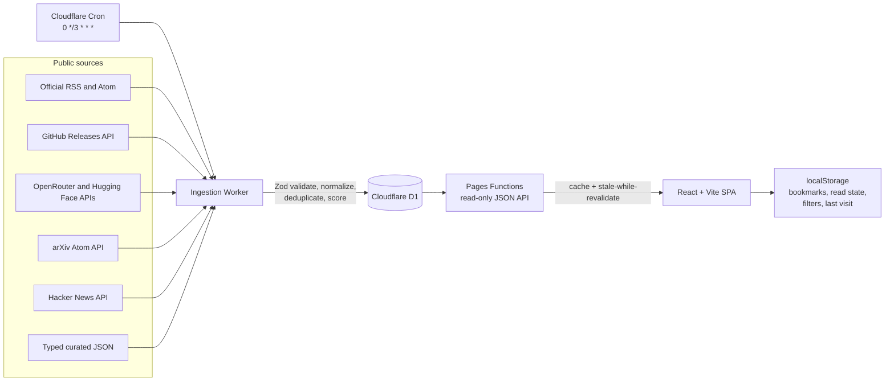

# AI Signal

AI Signal is a public, one-page intelligence dashboard for new AI models, coding agents, benchmarks, research papers, open-weight activity, pricing and context changes, and confirmed future dates. It ranks a small useful view from source-backed metadata instead of presenting an unfiltered feed.

Production: <https://ai-signal-euo.pages.dev/>

Worker health: <https://ai-signal-ingestion.ai-signal-euo.workers.dev/health>

All displayed facts retain their source, original URL, publication date, fetch date, content type, and provider or project when supplied. If data cannot be verified, the API preserves previously ingested D1 records and the interface reports stale or unavailable source state.

## Architecture

This npm-workspaces monorepo separates the browser, public API, ingestion Worker, and shared contracts.



The frontend is a single React page with anchored sections and Radix-managed dialogs/popovers. Pages Functions return the initial dashboard in one request. A separate Worker performs isolated source refreshes every three hours, writes source health and sync history, and retains 180 days of item metadata. D1 is the only persistent server-side store.

## Repository layout

```text
src/                 React UI, features, hooks, client utilities
functions/api/       Cloudflare Pages Functions JSON endpoints
functions/_lib/      D1 mapping, response caching, stale fallback
worker/src/adapters/ Source adapters with timeout and retry policy
worker/src/ingestion Normalization, persistence, source isolation
shared/              Zod schemas, types, source config, scoring
shared/data/         Curated benchmark snapshots and important dates
migrations/          D1 schema migrations
tests/               Vitest unit/integration and Playwright browser tests
public/              Security headers, manifest, icons, robots metadata
```

## Data flow and reliability

1. The Cron Trigger invokes the ingestion Worker every three hours.
2. The Worker synchronizes typed source definitions into `sources`.
3. Each enabled source runs independently with an abort timeout and limited retry/backoff.
4. Zod rejects malformed or incomplete source data. Externally supplied HTML is stripped and never rendered directly.
5. URLs are canonicalized by removing known tracking parameters, sorting meaningful query parameters, normalizing hosts and ports, and removing fragments/trailing slashes.
6. Items are deduplicated by source plus canonical URL and by a secondary provider/title/date/content hash. Separate reporting about the same announcement remains separate.
7. Deterministic importance and trend signals are stored with inspectable reason labels.
8. Successful source data is upserted into D1. One failed source does not abort other sources.
9. Source health and the overall sync summary are recorded. Items older than 180 days are pruned and expired confirmed events are archived.
10. Pages Functions serve D1 data with `max-age=180`, `stale-while-revalidate=10800`, and `stale-if-error=86400`. If D1 fails, the last verified edge response is returned with explicit stale headers and UI copy.

The browser also stores the last valid dashboard response. A small service worker caches the application shell, fonts, and static assets for resilient repeat visits; API failures still reach the app so cached dashboard data is explicitly marked stale. Production never imports the development fixture. The fixture is loaded only by Vite development when no API or browser cache is available and is visibly labelled.

## Source adapters

All sources live in [`shared/source-config.ts`](shared/source-config.ts). UI components never hardcode source records.

Enabled adapters:

| Purpose | Sources | Adapter |
| --- | --- | --- |
| Provider announcements | OpenAI News, Google DeepMind, Google for Developers, GitHub Copilot, Hugging Face Blog | RSS; Google entries use matching dates from the official sitemap |
| Coding-agent releases | `openai/codex`, `anthropics/claude-code`, `google-gemini/gemini-cli`, `Aider-AI/aider` | GitHub Releases API |
| Model metadata | OpenRouter Models API | JSON API, explicitly secondary evidence |
| Open-model interest | Hugging Face Hub API | JSON API; downloads/likes labelled as interest, not quality |
| Research | arXiv `cs.AI`, `cs.CL`, and `cs.SE` with relevance terms | arXiv Atom API |
| Community trend | Hacker News recent stories | Official HN API; popularity never validates claims |
| Important dates | `shared/data/manual-events.json` | Zod-validated curated JSON |
| Benchmarks | `shared/data/benchmark-snapshots.json` | Zod-validated curated JSON |

HTML metadata extraction exists as an isolated last-resort adapter, but sources without a stable verified feed are disabled by default. Anthropic News, Meta AI, Mistral AI, Microsoft AI, Qwen, and DeepSeek remain visible in configuration with the reason they are disabled. Google for Developers omits per-item RSS dates, so its adapter joins each official feed URL to the matching `lastmod` value in Google’s official sitemap. It never substitutes the feed-wide build date.

Nightly, draft, and prerelease GitHub releases are ignored unless `INCLUDE_PRERELEASES=true` is set on the Worker.

## Scoring methodology

Scoring constants are documented in [`shared/constants/scoring.ts`](shared/constants/scoring.ts). There is no hidden LLM ranking step.

Importance is a bounded 0-100 relative signal from:

- official provider sourcing;
- confirmed model or major coding-tool release;
- coding relevance;
- breaking change or deprecation;
- benchmark update;
- price or context-window change;
- source trust tier;
- recency;
- independent corroboration.

Trend score combines recent mention count, source diversity, trusted-source activity, bounded Hacker News engagement, and a documented recency half-life. The UI presents broad signal bands and a “Why this matters” explanation rather than claiming objective precision.

Benchmark records never compare different tracks as equivalent. The UI always shows:

> Benchmark scores measure different tasks and test setups. Compare models within the same benchmark and track.

## Requirements

- Node.js 22.12 or newer; Node 24 is used in the verified build
- npm 11 or newer
- A Cloudflare account for D1, Pages, and the scheduled Worker
- Wrangler authentication for deployment
- Playwright browsers for the browser suite

Core packages are locked to React 19.2.7, Vite 8.1.5, TypeScript 7.0.2, Tailwind CSS 4.3.3, Wrangler 4.112.0, Vitest 4.1.10, Playwright 1.61.1, and Zod 4.4.3.

## Local setup

```bash
npm ci
cp .dev.vars.example .dev.vars
npm run db:migrate:local
npm run dev
```

`npm run dev` starts the Vite browser app. When `/api/dashboard` is not available, Vite development loads the explicitly labelled development fixture.

For the full local Pages API:

```bash
npm run dev:pages
```

For the Worker with scheduled-event support:

```bash
npm run ingest:local
```

Then trigger one local scheduled run from another terminal:

```bash
curl "http://localhost:8787/__scheduled?cron=0+*/3+*+*+*"
```

## Environment variables

Copy `.dev.vars.example` to `.dev.vars`. Never commit `.dev.vars`.

| Variable | Required | Scope | Purpose |
| --- | --- | --- | --- |
| `SYNC_SECRET` | For manual HTTP ingestion only | Worker secret | Long random bearer secret for `POST /ingest` |
| `GITHUB_TOKEN` | No | Worker secret | Raises GitHub API rate limits |
| `OPENROUTER_API_KEY` | No | Worker secret | Optional authenticated OpenRouter access |
| `HUGGINGFACE_TOKEN` | No | Worker secret | Optional authenticated Hugging Face access |
| `INCLUDE_PRERELEASES` | No | Worker variable | Defaults to `false` |
| `VITE_REPOSITORY_URL` | No | Pages build variable | Overrides the default public repository link for forks or renamed repositories |

The public browser bundle never receives API tokens. Unauthenticated source requests still work, subject to lower provider rate limits.

Generate a suitable manual-sync secret without printing it to shell history where possible:

```bash
openssl rand -base64 48 | npx wrangler secret put SYNC_SECRET --config worker/wrangler.jsonc
```

Set optional Worker secrets with the same command:

```bash
npx wrangler secret put GITHUB_TOKEN --config worker/wrangler.jsonc
npx wrangler secret put OPENROUTER_API_KEY --config worker/wrangler.jsonc
npx wrangler secret put HUGGINGFACE_TOKEN --config worker/wrangler.jsonc
```

## Commands

| Command | Purpose |
| --- | --- |
| `npm run dev` | Vite frontend development |
| `npm run dev:pages` | Production build plus local Pages Functions and D1 |
| `npm run dev:worker` | Local ingestion Worker |
| `npm run build` | Typecheck and production Vite build |
| `npm run typecheck` | App, Pages Functions, shared code, and Worker TypeScript |
| `npm run lint` | Biome lint and accessibility-oriented static checks |
| `npm run test` | Vitest unit and integration tests |
| `npm run test:e2e` | Playwright on Chromium 1080p, Firefox, WebKit, and 390px mobile |
| `npm run test:all` | Lint, types, unit/integration, build, and browser tests |
| `npm run db:migrate:local` | Apply migrations to local D1 |
| `npm run db:migrate:dev` | Apply migrations to remote development D1 |
| `npm run db:migrate:remote` | Apply migrations to remote production D1 |
| `npm run ingest:local` | Start local Worker with scheduled-event endpoint |
| `npm run benchmarks:update` | Refresh official SWE-bench and Aider snapshots while preserving manual records |
| `npm run deploy:worker` | Deploy Worker and cron trigger |
| `npm run deploy:pages` | Build and deploy Pages assets/functions |

Install browser binaries once before E2E tests:

```bash
npx playwright install chromium firefox webkit
```

## Public API

All endpoints are read-only and return stable JSON objects with generated timestamps and cache metadata where relevant.

- `GET /api/dashboard`: initial-page aggregate
- `GET /api/items?type=&provider=&q=&since=&limit=`
- `GET /api/models?q=&provider=&open_weight=true&coding=true`
- `GET /api/benchmarks`
- `GET /api/events?include_archived=true`
- `GET /api/sources`

The Worker additionally exposes `GET /health` and optional `POST /ingest`. Manual ingestion requires `Authorization: Bearer <SYNC_SECRET>`, rejects short/unconfigured secrets, uses constant-time comparison, and applies a small in-memory abuse limit. Scheduled ingestion is the default.

## Database

[`migrations/0001_initial.sql`](migrations/0001_initial.sql) creates:

- `sources`
- `items`
- `models`
- `benchmark_results`
- `events`
- `sync_runs`

It includes indexes for publication date, type, provider, importance, trend, canonical URL, model release date, event start, and source health fields.

[`migrations/0002_item_identity.sql`](migrations/0002_item_identity.sql) removes any historic duplicate source URLs and enforces one row per source and canonical URL. Excerpt or metadata edits update that row while the content hash records that the source changed.

The repository contains distinct configurations for production and development:

- `wrangler.jsonc` and `worker/wrangler.jsonc` bind `ai-signal-prod`.
- `wrangler.dev.jsonc` and `worker/wrangler.dev.jsonc` bind `ai-signal-dev`.

D1 database IDs are deployment identifiers, not credentials. Account identifiers and tokens are not committed.

## Cloudflare deployment from a new account

The following is the complete sequence. Existing resource names may require a suffix; do not delete a same-named resource you do not own.

1. Install dependencies.

   ```bash
   npm ci
   ```

2. Authenticate Wrangler and verify the active account.

   ```bash
   npx wrangler login
   npx wrangler whoami
   ```

3. Create separate D1 databases.

   ```bash
   npx wrangler d1 create ai-signal-dev
   npx wrangler d1 create ai-signal-prod
   ```

4. Copy the returned development database ID into both `wrangler.dev.jsonc` files and the production ID into `wrangler.jsonc` and `worker/wrangler.jsonc`. Keep the binding name `AI_SIGNAL_DB`.

5. Apply migrations.

   ```bash
   npm run db:migrate:local
   npm run db:migrate:dev
   npm run db:migrate:remote
   ```

6. Configure Worker secrets. Only `SYNC_SECRET` is needed for the optional manual trigger; scheduled ingestion and all configured unauthenticated APIs work without paid keys.

   ```bash
   openssl rand -base64 48 | npx wrangler secret put SYNC_SECRET --config worker/wrangler.jsonc
   # Optional:
   npx wrangler secret put GITHUB_TOKEN --config worker/wrangler.jsonc
   npx wrangler secret put OPENROUTER_API_KEY --config worker/wrangler.jsonc
   npx wrangler secret put HUGGINGFACE_TOKEN --config worker/wrangler.jsonc
   ```

7. Register a `workers.dev` namespace if the account has never deployed a Worker, then deploy ingestion.

   ```bash
   npm run deploy:worker
   ```

   Wrangler prompts for the account-wide namespace once. The deployed output must list `schedule: 0 */3 * * *`.

8. Create and deploy Pages.

   ```bash
   npx wrangler pages project create ai-signal --production-branch main
   npm run deploy:pages
   ```

   Alternatively, connect the Git repository in Cloudflare Pages with build command `npm run build` and output directory `dist`.

9. Confirm that the Pages project’s production D1 binding is named `AI_SIGNAL_DB` and points to the same `ai-signal-prod` database as the Worker. Bind preview deployments to `ai-signal-dev` in the Pages dashboard if Git previews are enabled.

10. Verify the Cron Trigger in Workers & Pages → `ai-signal-ingestion` → Triggers. It must read `0 */3 * * *`. A successful `npm run deploy:worker` also prints the installed schedule.

11. Perform an initial ingestion after setting a secret.

   ```bash
   curl -X POST \
     -H "Authorization: Bearer $SYNC_SECRET" \
     https://ai-signal-ingestion.<your-workers-subdomain>.workers.dev/ingest
   ```

   A partial result is acceptable when it identifies the failed source and other sources succeeded. Inspect `/api/sources` afterward.

12. Open the Pages URL printed by Wrangler and verify both the page and API.

   ```bash
   curl -I https://<project>.pages.dev/
   curl https://<project>.pages.dev/api/dashboard
   ```

13. Optionally connect a custom domain in Pages → Custom domains. No custom domain is required.

14. Open the public URL in Firefox and bookmark it. Bookmarks inside AI Signal are browser-local and separate from the Firefox bookmark.

## Adding or repairing sources

### Add an RSS or Atom feed

1. Verify the official endpoint returns a stable feed with per-item title, original URL, and publication/update date.
2. Add one typed `SourceDefinition` to `shared/source-config.ts` with `type: "rss"` or `type: "atom"`.
3. Assign an honest trust tier, provider, item type, and restrained tags.
4. Add a feed fixture test covering its structure.
5. Run `npm run test && npm run typecheck` before enabling it.

Do not substitute a feed-level build time for a missing item publication date.

### Add a GitHub repository

Add a `github_releases` source definition:

```ts
{
  id: "src_project_releases",
  slug: "project-releases",
  name: "Project releases",
  homepageUrl: "https://github.com/owner/project/releases",
  trustTier: 3,
  enabled: true,
  adapter: {
    type: "github_releases",
    repository: "owner/project",
    provider: "Project",
    tags: ["coding-agent", "developer-tools"]
  }
}
```

Drafts are always ignored; prereleases follow `INCLUDE_PRERELEASES`.

### Add a benchmark snapshot

Append a record to `shared/data/benchmark-snapshots.json` matching `benchmarkResultSchema`. Required fields include benchmark slug, exact track, model, score/unit, evaluation date, snapshot date, source URL, optional agent/scaffold, notes, and `importMethod` (`automatic` or `manual`). Use only an official machine-readable source, official repository, or explicitly dated curated snapshot. Never mix tracks.

`npm run benchmarks:update` retrieves the top three current records for SWE-bench Verified, SWE-bench Multilingual, and Aider Polyglot directly from their official repositories, records the source commit in each note, and preserves manually verified records such as the dated SWE-rebench snapshot. The script writes only after every official source succeeds.

### Add an important date

Append a record to `shared/data/manual-events.json` matching `eventSchema`: exact start/end, category, provider, official source URL, verification timestamp, all-day flag, and confirmed status. Date ranges use an exclusive all-day `endsAt` for correct ICS output. Rumoured releases do not belong here.

### Repair a broken adapter

1. Leave the last verified D1 rows intact.
2. Reproduce the failure with a saved minimal response fixture, not a full copied article.
3. Verify the provider’s official format or API documentation.
4. Update only the isolated adapter/config needed for that source.
5. Extend malformed-response and normalization tests.
6. Re-enable a disabled source only after its title, URL, and date provenance are reliable.
7. Run the full suite and inspect `/api/sources` after the next sync.

## Accessibility, interaction, and privacy

- WCAG 2.2 AA-oriented landmarks, headings, labels, contrast, focus treatment, and 44px touch targets
- Skip link, Radix focus-managed dialogs, meaningful external-link labels, and non-colour status text
- `/` focuses global search; `Escape` clears transient search/closes dialogs; `j`/`k` navigate signal items; `b` bookmarks the active item
- Motion is restrained and collapses under `prefers-reduced-motion`
- Model tables become labelled stacked records at narrow widths without horizontal scrolling
- No account, analytics, tracking, or personal-data collection
- Bookmarks, unread state, filters, last visit, and one verified dashboard cache remain only in browser `localStorage`
- A same-origin service worker caches the application shell and static assets while `localStorage` retains the last dashboard; an explicit offline notice appears when connectivity is lost
- CSP, frame denial, MIME sniffing protection, referrer policy, permissions policy, and safe external-link attributes are included in `public/_headers`

## Cloudflare free-tier considerations

- One D1 database per environment; no KV, Queue, Vectorize, Durable Object, or paid model API is required.
- The three-hour cron produces eight scheduled invocations per day.
- Feed entries are capped per source and items are retained for 180 days to control D1 writes/storage.
- GitHub, Hugging Face, and OpenRouter work without keys but have lower unauthenticated rate limits.
- Public API responses use edge caching to reduce D1 reads.
- arXiv and Hacker News are intentionally relevance/sample limited.
- Check current Cloudflare limits before substantially increasing sources, retention, or cron frequency.

## Known limitations

- Several provider news sites do not publish a verified stable feed. Their disabled adapters are preserved in configuration with reasons instead of using brittle scraping.
- OpenRouter metadata is secondary evidence. It does not establish an official announcement, and open-weight status is shown as unverified unless another source confirms it.
- Hugging Face download and like counts are community-interest signals, not model-quality measures.
- Hacker News sampling is a trend input, not exhaustive coverage or technical verification.
- SWE-bench Pro, LiveCodeBench, and Arena cards remain source-only until their official leaderboard exports include enough dated, track-specific metadata for an honest snapshot. Dynamic HTML is not treated as a stable API.
- Optional provider tokens are not required; without narrowly scoped tokens, GitHub, Hugging Face, and OpenRouter use their lower anonymous rate limits.
- Offline mode supports repeat visits and cached reading, but external source links naturally require connectivity.

## Attribution and content policy

AI Signal stores titles, original URLs, dates, provider/author metadata, source-supplied short excerpts, and small public metadata fields needed for ranking. It does not copy full articles, bypass authentication or bot protection, resolve unsafe redirect chains, or render source HTML. Every source excerpt remains attributable to its publisher and every card links to the original source.

## Current deployment

- Pages project: `ai-signal`
- Public URL: <https://ai-signal-euo.pages.dev/>
- Ingestion Worker: `ai-signal-ingestion`
- Worker URL: <https://ai-signal-ingestion.ai-signal-euo.workers.dev/>
- Cron: `0 */3 * * *`
- D1: separate `ai-signal-dev` and `ai-signal-prod` databases in WEUR
- Analytics: disabled
- Public repository: <https://github.com/Zee-SS/ai-signal>

The Google Developers feed-date repair, verified benchmark snapshots, and offline service worker are included in the current release. Source-health details remain visible in the live dashboard after every scheduled run.
