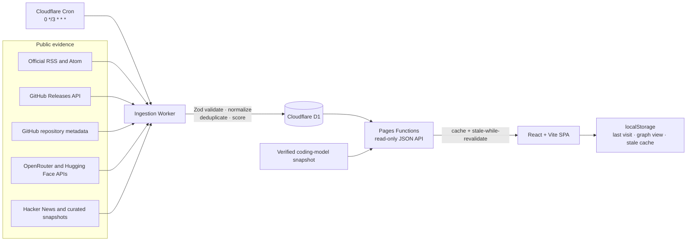

# AI Signal

AI Signal is a public, one-page coding-intelligence dashboard designed for a five-minute daily check. It shows which coding models currently lead, how quality trades against speed and cost, which local or browser agents are moving, which agent-skill ecosystems have momentum, and which verified coding releases are next.

Production: <https://ai-signal-euo.pages.dev/>

Worker health: <https://ai-signal-ingestion.ai-signal-euo.workers.dev/health>

The product deliberately excludes a global search box, a general news feed, long research-paper lists, and broad conference dates. Every displayed measurement or update retains an original source and freshness state. Production never substitutes development fixtures for failed data.

## What the page shows

- **Daily pulse:** four short decisions: quality leader, fastest measured cohort member, best value trade-off, and latest verified coding-agent release.
- **Coding model map:** an accessible quality-versus-speed scatterplot with a quality-versus-cost view and a readable mobile ranking.
- **Agent surfaces:** a clear split between terminal/PC tools and browser/cloud agents.
- **Trending skills:** compact momentum bars derived from live GitHub repository interest and recent maintenance.
- **Release radar:** only source-backed confirmed or explicitly predicted launches for models, agents, and important coding tools, with ICS export.
- **Source health:** a compact disclosure with fetch status, methodology, version, privacy statement, and original links.

The white-first visual system uses light leaf-green accents, Bricolage Grotesque for display moments, Geist for the interface, and Geist Mono for measured data. Interaction motion is short and tactile, while desktop wheel scrolling uses a gentle no-rebound glide; `prefers-reduced-motion` removes transforms, staggering, and custom scrolling.

## Architecture

This npm-workspaces monorepo separates the browser, public API, scheduled ingestion, shared contracts, and configuration.



The initial page uses one `GET /api/dashboard` request. A separate Worker refreshes enabled sources every three hours, records per-source health and sync history, and continues after individual source failures. D1 is the only persistent server-side store; KV is not required.

## Repository layout

```text
src/components/          Header, reveal behavior, loading and empty states
src/features/pulse/      Daily pulse, model map, tools/skills, dates, source footer
src/hooks/               API and connectivity state
functions/api/           Cloudflare Pages Functions JSON endpoints
functions/_lib/          D1 mapping, response cache, stale fallback
worker/src/adapters/     Feed, GitHub, JSON, arXiv, HN and curated adapters
worker/src/ingestion/    Normalization, persistence and source isolation
shared/schemas/          Zod contracts shared by UI, API and Worker
shared/source-config.ts  Typed source configuration
shared/data/             Verified model/benchmark snapshots and important dates
migrations/              D1 schema and identity constraints
tests/                   Vitest unit/integration and Playwright browser checks
public/                  Security headers, service worker, manifest and signal mark
```

## Data flow and failure behavior

1. The Cron Trigger invokes the Worker every three hours.
2. The Worker synchronizes `shared/source-config.ts` into the D1 `sources` table.
3. Each source runs independently with an abort timeout and limited exponential backoff.
4. Zod rejects malformed responses before they reach persistence.
5. URLs are canonicalized by removing known tracking parameters, normalizing hosts and slashes, preserving meaningful query parameters, and dropping fragments.
6. Dedupe uses source plus canonical URL and a secondary provider/title/date/content hash check. Separate original articles remain separate.
7. Deterministic importance and trend signals are stored with inspectable reasons.
8. Successful data is upserted; a failed adapter updates source health without emptying previous rows.
9. Pages Functions return D1 data with `max-age=180`, `stale-while-revalidate=10800`, and `stale-if-error=86400`.
10. If D1 fails, the last verified edge response is returned as stale. If the network fails after a visit, the browser uses its last valid response and labels it stale.

The service worker caches only the application shell and fingerprinted assets. API failures still reach React so old data is never silently presented as current.

## Sources and evidence

All automated sources are declared in [`shared/source-config.ts`](shared/source-config.ts). UI components do not hardcode source health or feed records.

| Signal | Initial sources | Adapter |
| --- | --- | --- |
| Provider updates | OpenAI News, Google DeepMind, Google for Developers, GitHub Copilot, Hugging Face | RSS or Atom |
| Stable coding-agent releases | Codex CLI, Claude Code, Gemini CLI, Aider | GitHub Releases API |
| Agent repository momentum | Codex, Claude Code, Gemini CLI, Aider, Cline, Roo Code, OpenHands | GitHub repository API |
| Skill repository momentum | OpenAI Skills, Anthropic Skills, Hugging Face Skills, Agent Skills standard | GitHub repository API |
| Model metadata | OpenRouter Models API | JSON API; secondary aggregation evidence |
| Open-model interest | Hugging Face Hub API | JSON API; likes/downloads are not quality |
| Community trend input | Hacker News | Official API; engagement is not technical verification |
| Important releases | `shared/data/manual-events.json` | Zod-validated curated JSON |
| Benchmark history | `shared/data/benchmark-snapshots.json` | Official repositories or dated curated snapshots |
| Coding model map | `shared/data/coding-model-snapshot.json` | Manually verified dated snapshot |

arXiv ingestion remains available in the backend configuration for compatibility, but research papers are not rendered on the focused public page. Sources without a verified stable feed remain disabled rather than being replaced with brittle page scraping.

### Coding model methodology

The model map intentionally keeps evidence types separate:

- **Coding quality:** official SWE-rebench resolved rate within one named leaderboard window and track.
- **Output speed:** Artificial Analysis output tokens per second, including its provider/variant description.
- **Run cost:** cost per SWE-rebench problem from the same quality leaderboard record.
- **Nuance:** a short deterministic comparison of those visible measurements.

Quality and speed are different tests, and some effort variants differ. The page discloses that caveat beside the chart and links both sources. It does not average the measurements into a fake universal score.

`shared/data/coding-model-snapshot.json` is a manually verified source snapshot because the quality and speed providers do not expose one shared stable API. Every record includes the exact variant, snapshot date, import method, and original URLs. Update it only after verifying every value at both original sources.

### Agent and skill momentum

The Worker fetches public repository stars, forks, open issues, and `pushed_at`. The dashboard derives a bounded relative momentum signal from log-scaled stars and recent maintenance. It is labelled as community interest and maintenance, never agent quality. A repository that has not completed its first sync appears as pending instead of receiving a fabricated value.

## Deterministic scoring

Item scoring constants live in [`shared/constants/scoring.ts`](shared/constants/scoring.ts). No hidden LLM ranks the feed.

Importance uses official sourcing, confirmed releases, coding relevance, breaking changes, benchmark or pricing changes, source trust, corroboration, and recency. Trend score uses recent mentions, source diversity, trusted-source weighting, bounded Hacker News engagement, and recency decay.

The focused page uses these item scores to choose the latest coding-tool release while the model map and repository momentum retain their own clearly named measurements.

## Requirements

- Node.js 22.12 or newer
- npm 11 or newer
- A Cloudflare account for Pages, D1, and the scheduled Worker
- Wrangler authentication for deployment
- Playwright browser binaries for browser tests

Core packages are locked to React 19.2.7, Vite 8.1.5, TypeScript 7.0.2, Tailwind CSS 4.3.3, Wrangler 4.112.0, Vitest 4.1.10, Playwright 1.61.1, and Zod 4.4.3.

## Local setup

```bash
npm ci
Copy-Item .dev.vars.example .dev.vars
npm run db:migrate:local
npm run dev
```

On macOS or Linux, use `cp .dev.vars.example .dev.vars` instead of `Copy-Item`.

`npm run dev` starts Vite. If `/api/dashboard` is unavailable, development mode loads a visibly labelled fixture. Production builds never import that fallback.

To run the Pages API and local D1:

```bash
npm run dev:pages
```

To run the scheduled Worker locally:

```bash
npm run ingest:local
```

Then trigger a local scheduled run from another terminal:

```bash
curl "http://localhost:8787/__scheduled?cron=0+*/3+*+*+*"
```

## Environment variables

Copy `.dev.vars.example` to `.dev.vars`. Never commit `.dev.vars`.

| Variable | Required | Scope | Purpose |
| --- | --- | --- | --- |
| `SYNC_SECRET` | Only for manual HTTP ingestion | Worker secret | Strong bearer secret for `POST /ingest` |
| `GITHUB_TOKEN` | No | Worker secret | Raises GitHub API limits for release and repository adapters |
| `OPENROUTER_API_KEY` | No | Worker secret | Optional authenticated OpenRouter access |
| `HUGGINGFACE_TOKEN` | No | Worker secret | Optional authenticated Hugging Face access |
| `INCLUDE_PRERELEASES` | No | Worker variable | Defaults to `false` |
| `VITE_REPOSITORY_URL` | No | Pages build variable | Overrides the public repository link |

The browser bundle never receives provider tokens. Unauthenticated APIs remain useful but have lower rate limits.

Set secrets without committing them:

```bash
npx wrangler secret put SYNC_SECRET --config worker/wrangler.jsonc
npx wrangler secret put GITHUB_TOKEN --config worker/wrangler.jsonc
npx wrangler secret put OPENROUTER_API_KEY --config worker/wrangler.jsonc
npx wrangler secret put HUGGINGFACE_TOKEN --config worker/wrangler.jsonc
```

Only `SYNC_SECRET` is relevant to the optional manual endpoint; scheduled ingestion works without it. All provider tokens are optional.

## Commands

| Command | Purpose |
| --- | --- |
| `npm run dev` | Vite frontend development |
| `npm run dev:pages` | Production build plus local Pages Functions and D1 |
| `npm run dev:worker` | Local ingestion Worker |
| `npm run build` | Typecheck and production Vite build |
| `npm run typecheck` | Frontend, shared, Functions, and Worker TypeScript |
| `npm run lint` | Biome static and accessibility-oriented checks |
| `npm run test` | Vitest unit and integration tests |
| `npm run test:e2e` | Chromium 1920×1080, Firefox, WebKit, and 390px mobile |
| `npm run test:all` | Full lint, types, tests, build, and browser suite |
| `npm run db:migrate:local` | Apply migrations to local D1 |
| `npm run db:migrate:dev` | Apply migrations to remote development D1 |
| `npm run db:migrate:remote` | Apply migrations to production D1 |
| `npm run ingest:local` | Start the local scheduled Worker endpoint |
| `npm run benchmarks:update` | Refresh supported official benchmark snapshots |
| `npm run deploy:worker` | Deploy Worker and cron trigger |
| `npm run deploy:pages` | Build and deploy Pages assets and Functions |

Install browser binaries once:

```bash
npx playwright install chromium firefox webkit
```

## Public API

All Pages endpoints are public, read-only, typed JSON with cache and freshness metadata.

- `GET /api/dashboard` returns the initial aggregate, including `codingModels` and `codingLandscape`.
- `GET /api/items?type=&provider=&q=&since=&limit=`
- `GET /api/models?q=&provider=&open_weight=true&coding=true`
- `GET /api/benchmarks`
- `GET /api/events?include_archived=true`
- `GET /api/sources`

The Worker exposes `GET /health` and optional `POST /ingest`. Manual ingestion requires `Authorization: Bearer <SYNC_SECRET>`, rejects weak or missing secrets, uses constant-time comparison, and applies a small in-memory abuse limit. Cron remains the default.

## Database

[`migrations/0001_initial.sql`](migrations/0001_initial.sql) creates `sources`, `items`, `models`, `benchmark_results`, `events`, and `sync_runs`, plus indexes for publication time, type, provider, importance, trend, canonical URL, model dates, event dates, and source health.

[`migrations/0002_item_identity.sql`](migrations/0002_item_identity.sql) removes historic duplicate source URLs and enforces one row per source and canonical URL. Repository activity therefore updates one current record instead of generating a noisy item every three hours.

Production configurations bind `ai-signal-prod`; development configurations bind `ai-signal-dev`. Both the Pages Functions and Worker must use the same database within an environment.

## Cloudflare deployment from a new account

Do not delete or overwrite same-named resources you do not own. Add a suffix if a name is already taken.

1. Install dependencies.

   ```bash
   npm ci
   ```

2. Authenticate and verify the selected Cloudflare account.

   ```bash
   npx wrangler login
   npx wrangler whoami
   ```

3. Create separate D1 databases.

   ```bash
   npx wrangler d1 create ai-signal-dev
   npx wrangler d1 create ai-signal-prod
   ```

4. Copy the development database ID into `wrangler.dev.jsonc` and `worker/wrangler.dev.jsonc`. Copy the production ID into `wrangler.jsonc` and `worker/wrangler.jsonc`. Keep the binding name `AI_SIGNAL_DB`.

5. Apply migrations.

   ```bash
   npm run db:migrate:local
   npm run db:migrate:dev
   npm run db:migrate:remote
   ```

6. Set the manual sync secret and any optional provider tokens.

   ```bash
   npx wrangler secret put SYNC_SECRET --config worker/wrangler.jsonc
   # Optional:
   npx wrangler secret put GITHUB_TOKEN --config worker/wrangler.jsonc
   npx wrangler secret put OPENROUTER_API_KEY --config worker/wrangler.jsonc
   npx wrangler secret put HUGGINGFACE_TOKEN --config worker/wrangler.jsonc
   ```

7. Deploy the ingestion Worker.

   ```bash
   npm run deploy:worker
   ```

   Wrangler must report `schedule: 0 */3 * * *`.

8. Create and deploy Pages.

   ```bash
   npx wrangler pages project create ai-signal --production-branch main
   npm run deploy:pages
   ```

   For Git-connected Pages, use build command `npm run build` and output directory `dist`.

9. In the Pages project, bind production `AI_SIGNAL_DB` to the same `ai-signal-prod` database used by the Worker. Bind previews to `ai-signal-dev` if preview deployments are enabled.

10. Verify Workers & Pages → `ai-signal-ingestion` → Triggers shows `0 */3 * * *`.

11. Perform an initial ingestion.

   ```bash
   curl -X POST \
     -H "Authorization: Bearer $SYNC_SECRET" \
     https://ai-signal-ingestion.<your-workers-subdomain>.workers.dev/ingest
   ```

12. Verify the page and typed API.

   ```bash
   curl -I https://<project>.pages.dev/
   curl https://<project>.pages.dev/api/dashboard
   curl https://<project>.pages.dev/api/sources
   ```

13. Optionally connect a custom domain under Pages → Custom domains.

14. Open the public URL in Firefox and bookmark it.

## Maintaining content and adapters

### Add an RSS or Atom feed

1. Verify the official endpoint supplies per-item title, original URL, and publication/update date.
2. Add one `SourceDefinition` in `shared/source-config.ts` with `type: "rss"` or `type: "atom"`.
3. Assign an honest trust tier, provider, item type, and restrained tags.
4. Add a saved minimal response test.
5. Run `npm run test && npm run typecheck` before enabling it.

Never substitute a feed-wide build time for a missing item publication date.

### Add a GitHub coding tool

Use `github_releases` for stable releases and `github_repository` for momentum. A repository-momentum adapter must include `projectName`, `kind` (`agent` or `skill`), `surface` (`terminal`, `desktop`, `browser`, or `portable`), a concise description, and honest tags. Repository popularity must remain labelled as interest, not quality.

Draft releases are always ignored; prereleases follow `INCLUDE_PRERELEASES`.

### Update the coding model map

1. Open the current official SWE-rebench leaderboard and the relevant Artificial Analysis model page.
2. Confirm exact model and effort variants, resolved rate, run cost, speed, and snapshot date.
3. Update `shared/data/coding-model-snapshot.json`.
4. Keep `importMethod: "manual"` and link both original sources.
5. Write one nuance sentence that states a visible trade-off without inventing capability claims.
6. Run schema, browser, and visual checks.

Do not combine tracks or copy a provider marketing benchmark into the SWE-rebench axis.

### Add a benchmark snapshot

Append a record to `shared/data/benchmark-snapshots.json` matching `benchmarkResultSchema`. Include the exact track, model, score and unit, evaluation date, snapshot date, original URL, agent/scaffold where relevant, notes, and import method. Use only an official machine-readable source, official repository, or explicitly dated curated snapshot.

### Add a release date

Append a record to `shared/data/manual-events.json` matching `eventSchema`. Categories must identify a model, agent, tool, release, or launch to appear on the public radar.

- `confirmed` requires an exact date from an original source.
- `predicted` requires a source-backed public roadmap or explicit date forecast. It must not be inferred from cadence, rumours, or social speculation.
- Include the source URL and verification timestamp.

Expired confirmed and predicted dates are archived automatically.

### Repair a broken adapter

1. Preserve previous D1 rows.
2. Reproduce the failure with a minimal response fixture.
3. Verify the provider’s current official API or feed format.
4. Change only the isolated adapter or source definition.
5. Extend malformed-response and normalization tests.
6. Re-enable only after title, URL, and date provenance are reliable.
7. Run the full suite and inspect `/api/sources` after a sync.

## Accessibility, interaction, and privacy

- WCAG 2.2 AA-oriented landmarks, headings, contrast, labels, and visible focus
- 44px minimum touch targets and no horizontal overflow at 390px
- semantic buttons for model selection and source-safe external links
- sticky single-DOM navigation with an IntersectionObserver-driven rounded morph
- bouncy press feedback and staged reveals, removed under reduced motion
- accessible chart title/description plus a complete labelled model list
- no account, analytics, tracking, or personal-data collection
- only last visit, graph preference, and a verified dashboard cache stored locally
- CSP, frame denial, MIME sniffing protection, referrer policy, permissions policy, and same-origin service worker

## Cloudflare free-tier considerations

- One D1 database per environment; no KV, Queue, Vectorize, Durable Object, or paid model API is required.
- The three-hour cron produces eight scheduled invocations per day.
- Repository adapters add a small number of GitHub requests; a token is recommended if sources expand substantially.
- Feed entries remain capped and old items are pruned after 180 days.
- Public responses use edge caching to reduce D1 reads.
- Check current Cloudflare limits before increasing frequency, sources, or retention.

## Known limitations

- The quality-versus-speed map is a dated curated snapshot because the measurement providers do not share one stable machine-readable export.
- Speed varies by provider, load, prompt, and reasoning effort; exact variants are shown and linked.
- GitHub stars favor older or broadly marketed repositories and do not prove agent quality.
- Several provider news sites still lack stable official feeds and remain disabled instead of being scraped.
- OpenRouter is secondary metadata and never primary evidence for an announcement.
- Unauthenticated GitHub, Hugging Face, and OpenRouter access has lower rate limits.
- Release predictions appear only with an explicit source-backed basis, so an empty radar is normal.
- Offline mode supports resilient repeat reading, while external sources naturally require connectivity.

## Attribution and content policy

AI Signal stores titles, original URLs, dates, provider/author metadata, source-supplied short excerpts, and small public metadata fields needed for scoring. It does not copy full articles, render external HTML, bypass authentication or bot protection, resolve unsafe redirect chains, or present community popularity as technical verification.

## Current deployment

- Pages project: `ai-signal`
- Public URL: <https://ai-signal-euo.pages.dev/>
- Ingestion Worker: `ai-signal-ingestion`
- Worker URL: <https://ai-signal-ingestion.ai-signal-euo.workers.dev/>
- Cron: `0 */3 * * *`
- Production D1: `ai-signal-prod`
- Development D1: `ai-signal-dev`
- Analytics: disabled
- Repository: <https://github.com/Zee-SS/ai-signal>
